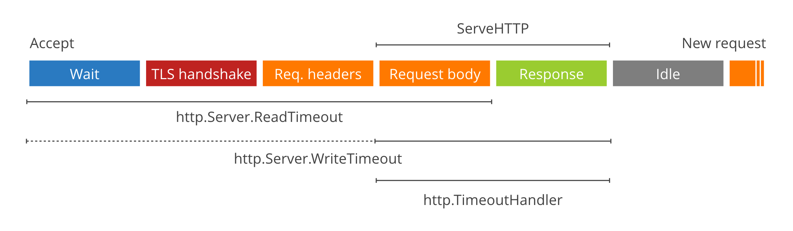

# RUDY (Are You Dead Yet?)
The purpose of this repository is to show some strategies to mitigate RUDY attacks on HTTP servers written with Go.

### Understanding the problem
By default, the http servers written with Go are vulnerable to `RUDY` attacks and similar attacks, but do not panic,
here are tips to mitigate this vulnerability.
```go
package main

import (
    "log"
    "net/http"
)

func main() {
    log.Println("HTTP server in running on :8080")
    log.Fatal(http.ListenAndServe(":8080", nil))
}
```

If we sent http requests indicating that we will send `n` bytes but no send any byte the connection keeps alive.
```shell
curl -X POST "http://localhost:8080" -H "Content-Length: 10" -v
```
Also, If we sent http requests simulating a poor connection, we will keep the connection alive.

Example of RUDY attack:
```shell
curl -X POST "http://localhost:8080" -H "Content-Length: 11" -d "Yael Castro" --limit-rate "1B" -v
```
### How to mitigate these attacks
###### S et reasonable timeouts ([See code](./cmd/timeout/main.go))
We can configure a `ReadTimeout` to avoid too large connections.
The `ReadTimeout` indicates how long a request will wait to receive the headers and body.



An alternative approach is close the connection for each endpoint when is taking too long.

**For example.** When we detected a request that is taking too long, we can close the connection
using the [http.ResponseController](https://pkg.go.dev/net/http#ResponseController)

> ⚠️ `http.ResponseController` only works in Go 1.20 or later versions, but don't worry,
> depending on the framework or version there is always an alternative.

###### Limit request body sizes ([See code](./cmd/limit/main.go))
Limit request body sizes to prevent slow data transmission.
- If the body is larger than you expected, close the connection.
- If you expected a request body, and it is not present, close the connection.

<!-- - Set reasonable limits for request body based on the requirements. -->
###### Use a reverse proxy
In my opinion, the best approach in most scenarios is to use a dedicated reverse proxy designed specifically to mitigate these types of attacks.
However, it is also important to know how to mitigate this vulnerability in the code.


### References
[The complete guide to Go net/http timeouts](https://blog.cloudflare.com/the-complete-guide-to-golang-net-http-timeouts/)

[R U Dead Yet? (R.U.D.Y.) attack](https://www.cloudflare.com/learning/ddos/ddos-attack-tools/r-u-dead-yet-rudy/)